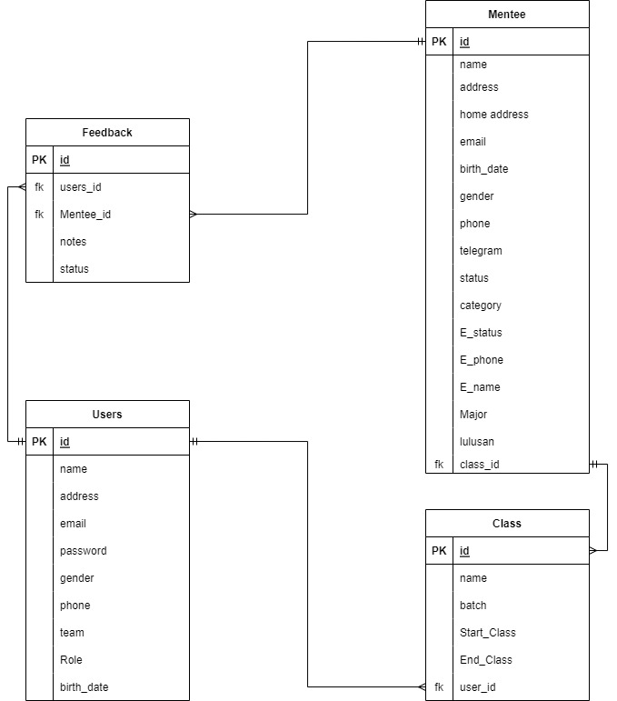
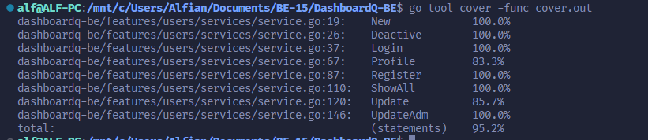
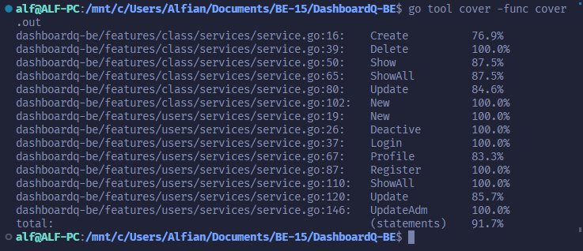

### Build App & Database


# Brain Academy Dashboard

This is a golang rest api project group organized by Alterra Academy. This API is used to run Brain Academy Dashboard App. This application has features as below.


# Features
## User & Admin:
- Login
- Register user 
- Show profile user
- Show all list users
- Edit profile by Admin
- Edit profile by user
- Deactive account

<div>

<details>

| Feature User & Admin | Endpoint | Param | JWT Token | Function |
| --- | --- | --- | --- | --- |
| POST | /login  | - | NO | This is how users & admin log in.  |
| POST | /register | - | YES | This is how admin register user account. |
| GET | /users | - | YES | Admin show all users list. |
| PUT | /users/ID | ID | YES | This is how Admin update users profile. |
| DELETE | /users/ID | ID | YES | This is how Admin Delete user account. |
| GET | /profile/ID | ID | YES | Users obtain their account information in this form. |
| PUT | /profile | - | YES | This is how users Delete their profile. |

</details>

<div>

## Mentee :
- Add mentee
- Show all mentee

<div>

<details>

| Feature Product | Endpoint | Param | JWT Token | Function |
| --- | --- | --- | --- | --- |
| POST | /mentee | - | YES | This is how users add mentee. |
| GET | /mentee  | - | YES | This is how all mentees show in app.  |

</details>

</div>

## Class :
- Add class
- Show all class
- Delete all class
- Edit or Update detail class

<div>

<details>

| Feature Cart | Endpoint | Param | JWT Token | Function |
| --- | --- | --- | --- | --- |
| POST | /class | - | YES | This is how users add class. |
| GET | /class/ID  | ID | YES | This is how show all class.  |
| GET | /class  | - | YES | This is how show all class in cart.  |
| PUT | /class/ID | ID CART | YES | Users edit their class detail. |
| DELETE | /class/ID | ID CART | YES | This is how users Delete their class. |

</details>


</div>


# ERD


# API Documentations

[Click here](https://app.swaggerhub.com/apis-docs/ALFIANADSAPUTRA_1/DashboardQ/1.0.0) to see documentations.


## How to Install To Your Local

- Clone it

```
$ git clone https://github.com/ALTA-PROJECT2-GROUP4/DashboardQ-BE.git
```

- Go to directory

```
$ cd DashboardQ-BE
```

# UNIT TEST COVERAGE BY FEATURE

<div>
- USER
</div>
<div>

</div>

<div>
- MENTEE
</div>
<div>

</div>

<div>
- CLASS
</div>
<div>

</div>

<div>
- FEEDBACK
</div>
<div>

</div>

# UNIT TEST COVERAGE ALL


## Authors 👑

-   Yazki Baynurrahman [](https://github.com/1makki)

-   Adi Yuda Pranata [](https://github.com/Adiyuda123)

-  Alfian Aditya [](https://github.com/alfianadityads)

 <p align="right">(<a href="#top">back to top</a>)</p>
<h3>
<p align="center">:copyright: March 2023 </p>
</h3>
<!-- end -->
<!-- comment -->